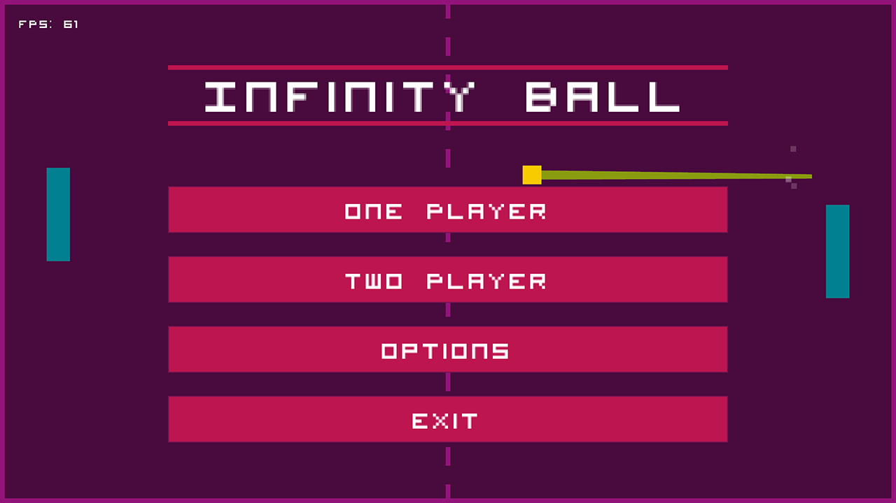

# Infinity Ball

Infinity Ball is a fun, reincarnation of Pong that I built. It was created for a high school project, and it was the first major software project that I ever completed. I did not use Git back then, but I have created a repository to preserve the project. 

